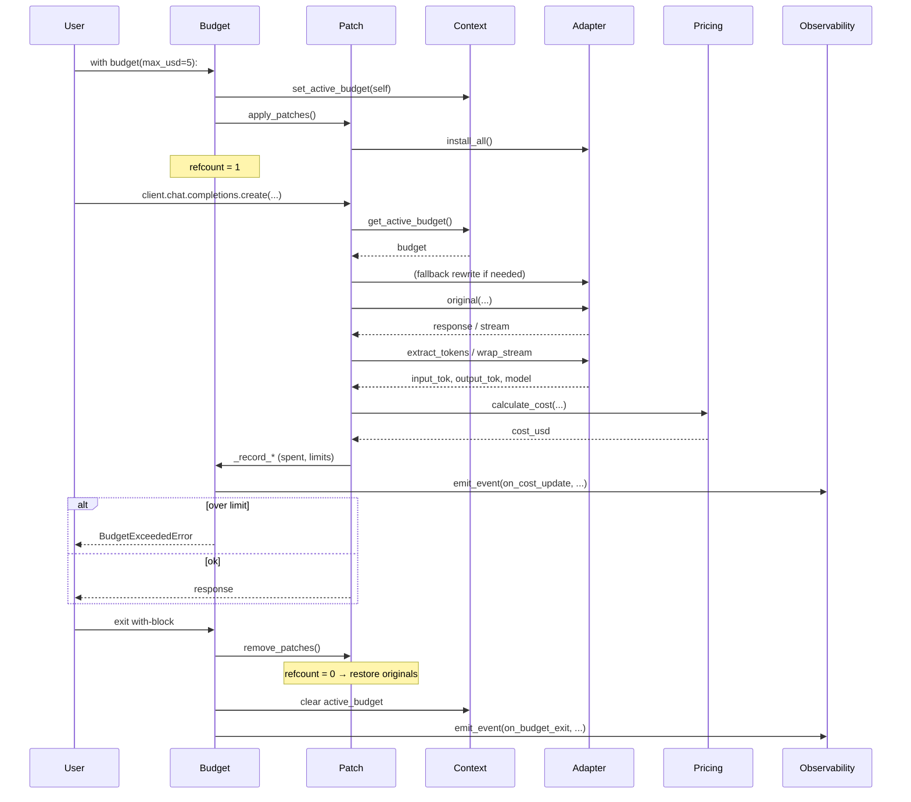
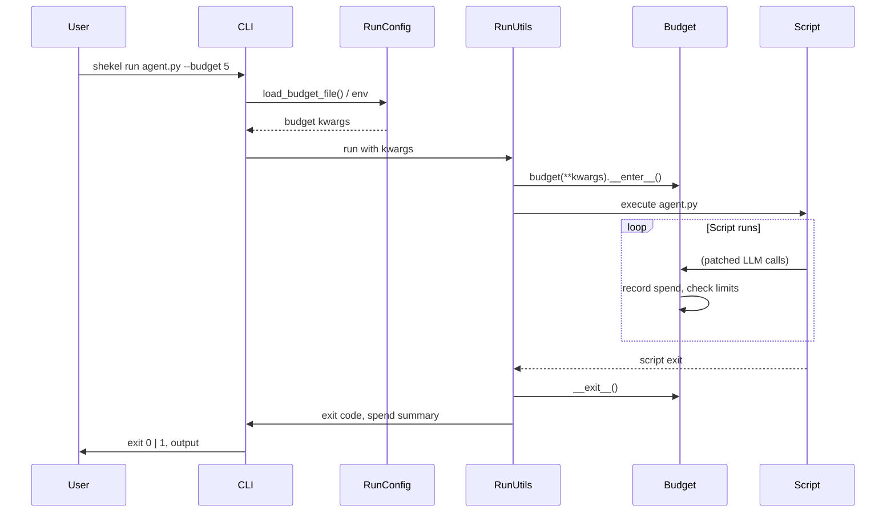

# Data Flow

## Library: one LLM call under a budget

1. User enters `with budget(max_usd=5.00):`.
2. `Budget.__enter__`: set `_active_budget` to this budget, call `apply_patches()` (refcount 1 → install all adapters).
3. User calls `client.chat.completions.create(...)` (or another patched method).
4. Patched wrapper runs: resolve provider, apply fallback model if active, call original; get response or stream.
5. If streaming: adapter's `wrap_stream` consumes the stream and yields chunks; at end, token counts are returned and used for cost.
6. Token extraction (adapter) → `calculate_cost` (pricing) → `budget._record_*` (update spent, check limits).
7. If over limit: raise `BudgetExceededError` (or `ToolBudgetExceededError` for tools). Optionally emit observability events.
8. On `with` exit: `remove_patches()` (refcount 0 → restore originals), clear `_active_budget`, emit exit events.

### Sequence diagram (library)

## CLI: shekel run

1. User runs `shekel run agent.py --budget 5`.
2. CLI parses flags and optional `--budget-file` / env into budget kwargs.
3. Run layer (e.g. `_run_utils`) creates a `Budget` with those kwargs and enters it.
4. User script is executed (same process or subprocess depending on implementation); any patched SDK calls are tracked and enforced.
5. On script end, budget context exits; CLI reports spend and exit code (e.g. 1 if budget exceeded).

### Sequence diagram (CLI)

