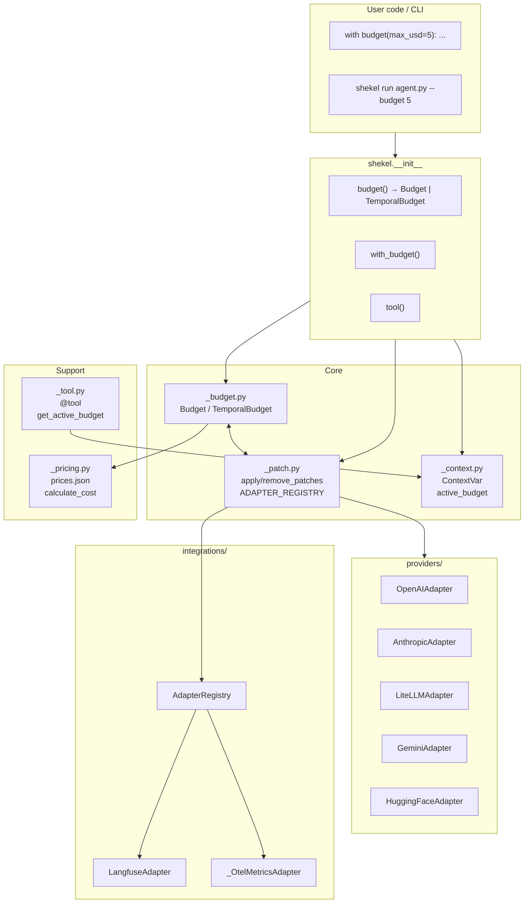

# Overview

## High-level design

Shekel is an **in-process, zero-config** LLM cost governance library. It does not require API keys, external services, or global initialization. It works by:

1. **Monkey-patching** provider SDKs (OpenAI, Anthropic, LiteLLM, Gemini, HuggingFace) when a budget context is entered
2. **Tracking spend** in a thread- and async-safe way via `ContextVar`
3. **Enforcing limits** (USD, call count, tool count, or temporal windows) before or after each intercepted call
4. **Restoring** original SDK methods when the last budget context exits (ref-counted)

## Entry points

Two entry points exist:

- **Library**: `with budget(max_usd=5.00): run_agent()` — patches apply for the duration of the context.
- **CLI**: `shekel run agent.py --budget 5` — runs the script in a subprocess with a budget context wrapping the execution.

## Component diagram

Next: [Core Components](components.md)
